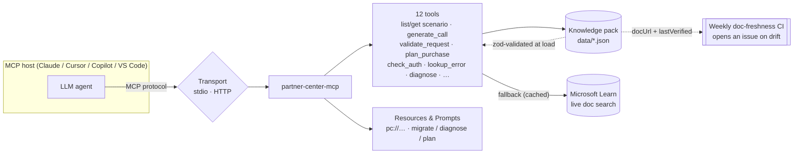

# partner-center-mcp

An MCP server that helps you build against the **Partner Center REST API**: scenario
discovery, ready-to-run REST examples, current authentication guidance, an auth deprecation
linter, archived-.NET-SDK → REST migration, error decoding, and reference. Grounded in a
curated, date-versioned knowledge pack plus live Microsoft Learn doc fetch. It holds **no
credentials** and makes **no live Partner Center calls** — it is a knowledge & codegen assistant.

> **Unofficial, community project** — not affiliated with, sponsored, or endorsed by Microsoft.
> "Partner Center" and "Microsoft" are trademarks of Microsoft, used here only descriptively.


## Why

The Partner Center .NET SDK (3.4.0) was archived in June 2023; Microsoft directs partners to
the REST APIs. Deprecated auth (the retired `graph.windows.net` audience) still causes
401 / `900420` failures, and from **2026-04-01** App+User API usage enforces MFA. This server
steers you to the current REST + auth patterns and decodes the errors you hit along the way.

## How it works

Your MCP host (Claude Code, Cursor, Copilot, VS Code…) talks to this server over the MCP
protocol (stdio by default, or HTTP). The server answers from a **curated knowledge pack** that
is zod-validated at load and grounded in official Microsoft Learn docs — falling back to a
**cached live doc search** only when needed. It never sees your credentials and never calls
Partner Center.



A typical call: the agent picks a tool (e.g. `pc_generate_call`), the server looks the scenario
up in the pack, and returns the verified method, path, headers, a ready code sample, and gotchas —
each carrying the `docUrl` it was verified against.

## Run

```bash
npx partner-center-mcp
```

No configuration, API keys, or network access to Partner Center required.

## Add to your MCP host

The server speaks MCP over **stdio**, so any MCP-capable host works — there's nothing
host-specific to install. Use whichever config your host expects:

**VS Code** (`.vscode/mcp.json`) and **Visual Studio** (`.mcp.json`):

```json
{ "servers": { "partner-center": { "command": "npx", "args": ["-y", "partner-center-mcp"] } } }
```

**GitHub Copilot** — Copilot reads the same `.vscode/mcp.json` (VS Code) / `.mcp.json` (Visual
Studio) shown above; no extra config needed.

**Cursor** (`.cursor/mcp.json`) and **Windsurf** (`~/.codeium/windsurf/mcp_config.json`):

```json
{ "mcpServers": { "partner-center": { "command": "npx", "args": ["-y", "partner-center-mcp"] } } }
```

**Claude Code:**

```bash
claude mcp add partner-center -- npx -y partner-center-mcp
```

**Claude Desktop** (`claude_desktop_config.json`), **Cline**, and **Zed** use the same
`mcpServers` shape as Cursor above.

> Tip: also add the **Microsoft Learn MCP server** (`https://learn.microsoft.com/api/mcp`)
> alongside this one for broad documentation search.

### Remote / HTTP (optional)

Prefer a hosted endpoint over stdio? Run the Streamable HTTP variant:

```bash
PORT=3000 npx -p partner-center-mcp partner-center-mcp-http
# MCP endpoint: POST http://localhost:3000/mcp   •   health: GET /healthz
```

## Tools

| Tool | Purpose |
| --- | --- |
| `pc_list_scenarios` | List supported REST scenarios, optionally filtered by `area`. |
| `pc_get_scenario` | Full detail for one scenario: method, path, headers, examples, gotchas. |
| `pc_generate_call` | Emit a current REST call (`curl`/`csharp`/`typescript`/`powershell`) with auth/retry/pagination helpers. Never the archived SDK. |
| `pc_validate_request` | Lint a REST call (method, URL, headers, auth) against the known scenarios. |
| `pc_plan_purchase` | The ordered New Commerce purchase workflow: product → SKU availability → cart → checkout → subscriptions. |
| `pc_migrate_from_sdk` | Translate archived .NET SDK code into the equivalent REST scenario(s). |
| `pc_auth_guidance` | Current auth guidance for app-only / app+user, per national cloud, with GDAP + MFA notes. |
| `pc_check_auth` | Lint an auth/client snippet for retired patterns (graph.windows.net, ADAL, archived SDK, AzureAD PS). |
| `pc_build_request` | Build a ready-to-send request: fills path placeholders, generates `MS-RequestId`/`MS-CorrelationId`, and a body skeleton from the scenario's fields. |
| `pc_plan_transfer` | Ordered billing-ownership transfer workflow (create → poll → verify). |
| `pc_plan_gdap_onboarding` | Ordered GDAP onboarding workflow (create → approve → verify) over Microsoft Graph. |
| `pc_plan_csp_onboarding` | Ordered CSP customer onboarding (account linking): invite → verify relationship → confirm agreement → transact. |
| `pc_plan_reconciliation` | Ordered reconciliation workflow (invoice → billed/unbilled line items → statement). |
| `pc_lookup_error` | Decode an error code: causes, remediation, and the scenarios it commonly hits. |
| `pc_decode_error` | Paste a raw error response → decoded code, likely scenarios, and the correlation id for support. |
| `pc_diagnose` | Map a symptom to likely causes, fixes, and relevant scenarios. |
| `pc_get_enums` | Look up enum values (billingCycle, termDuration, targetView, transitionType, status, …). |
| `pc_get_resource` | Field dictionary for resources (Customer, Subscription, Order, Invoice, …). |
| `pc_whats_new` | Deprecations & deadlines (MFA enforcement, graph.windows.net, v1→v2 reconciliation, …). |
| `pc_search_docs` | Search the curated pack and fetch live Microsoft Learn docs. |
| `pc_get_reference` | Base URLs, headers, versioning, sandbox, rate limits, national-cloud differences. |

## Coverage

Scenarios span **customers**, **subscriptions** (incl. New Commerce migration), **orders &
carts**, **catalog/products**, **licenses**, **invoicing/billing**, **utilities** (address &
domain validation), **audit**, **support**, **security/MFA**, **analytics**, and **profiles** —
each with a verified `docUrl` and `lastVerified` date. National clouds covered: commercial,
21Vianet (China), and US Gov.

The pack is also exposed as MCP **resources** (`pc://scenarios`, `pc://errors`, `pc://auth`,
`pc://reference`, `pc://sdk-map`, `pc://enums`, `pc://deprecations`, `pc://resources`, and
`pc://scenario/{id}`) and three **prompts** (`migrate-sdk`, `diagnose-issue`, `plan-purchase`)
for hosts that surface them.

It also ships reference datasets — **enum values**, a **resource field dictionary**, and a
**deprecations & deadlines** timeline — and can **export** the whole pack to an OpenAPI 3.0 spec
and a Postman collection (`npm run export`).

## Examples

Decode an error you hit in production:

```jsonc
// pc_lookup_error { "code": "900420" }
{
  "httpStatus": 401,
  "errorCode": "900420",
  "description": "The audience in the token is invalid and is no longer supported in Partner Center API.",
  "causes": ["Token requested with the retired graph.windows.net audience"],
  "remediation": "Request the token with resource https://api.partnercenter.microsoft.com ...",
  "docUrl": "https://learn.microsoft.com/partner-center/developer/deprecate-azure-active-directory-graph-token"
}
```

Lint old auth/client code before you ship it:

```jsonc
// pc_check_auth { "code": "new AuthenticationContext(); get(\"https://graph.windows.net\"); partner.Customers..." }
{
  "findings": [
    { "severity": "error",   "message": "Uses the retired graph.windows.net audience; Partner Center returns 401 / 900420.", "fix": "Request the token with resource https://api.partnercenter.microsoft.com." },
    { "severity": "warning", "message": "Appears to use ADAL, which is deprecated.", "fix": "Use MSAL with the secure application model." }
  ],
  "clean": false
}
```

Catch a wrong call before you make it:

```jsonc
// pc_validate_request { "method": "POST", "url": "/v1/customers/abc/subscriptions", "headers": { "Authorization": "Bearer x" } }
{
  "ok": false,
  "findings": [
    { "severity": "error", "message": "Path matches a known scenario but the method POST is wrong; expected GET.",
      "fix": "Use GET for /v1/customers/{customer-id}/subscriptions." }
  ]
}
```

## Develop

```bash
npm install
npm test
npm run build
```

The knowledge pack lives in `data/` (date-versioned; each record carries a `docUrl` and
`lastVerified`). Schemas in [`src/knowledge/schema.ts`](src/knowledge/schema.ts) validate every
file at load time, so malformed or drifted data fails fast. `npm run check-docs` verifies every
`docUrl` still resolves, flags stale entries, and detects content drift (page-hash baseline); a
weekly GitHub Action runs it and opens an issue on drift. `npm run eval` runs a deterministic
golden-case suite; `npm run eval:llm` (needs `ANTHROPIC_API_KEY`) checks that a real model picks
the right tool for a question; `npm run export` emits an OpenAPI spec + Postman collection.

To regenerate the demo GIF (after `npm run build`): install [vhs](https://github.com/charmbracelet/vhs)
and run `vhs demo.tape` (writes `assets/demo.gif`).

## Contributing

New scenarios and doc-accuracy fixes are very welcome — see [CONTRIBUTING.md](CONTRIBUTING.md).
This is an unofficial, community project and is not affiliated with Microsoft.
